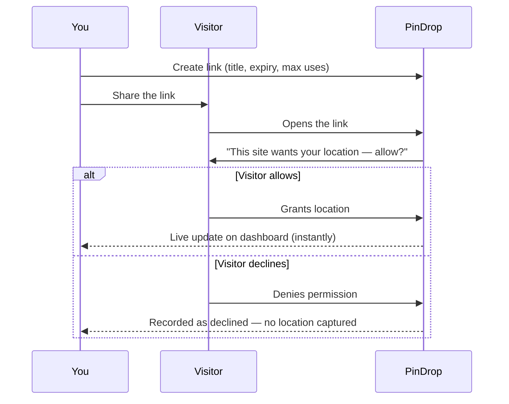

<div align="center">
  

  # PinDrop

  **Ask. They allow. You see.**

  Consent-based location sharing links — create a link, share it anywhere, and see exactly where it was opened the moment someone says yes. Never before.

  [Live Site](https://pindrop-locationtracker.firebaseapp.com) · [Report a Bug](https://github.com/vabxsen/PinDrop/issues)

</div>

---

## 📖 Table of Contents

- [About](#-about)
- [Features](#-features)
- [How It Works](#-how-it-works)
- [Tech Stack](#️-tech-stack)
- [Project Structure](#-project-structure)
- [Getting Started](#-getting-started)
- [Security](#-security)
- [Deployment](#-deployment)
- [License](#-license)

## 🧭 About

Sharing your live location usually means either texting a screenshot of a map or handing over continuous, ongoing tracking through your phone's built-in "share my location" feature. PinDrop is neither. It's a single-purpose tool: create a link, send it to someone, and the moment they explicitly grant permission, you see exactly where they are — once, on request, with nothing captured before they say yes and nothing lingering after.

No app install and no account needed on the visitor's end — just a link that opens in any browser.

## ✨ Features

- 🔗 **Shareable consent links** — create a link with a title, optional expiry date, and a max-use limit
- ✅ **Explicit opt-in only** — nothing is captured until the visitor's browser asks and they say yes
- 📍 **Real-time location delivery** — granted locations land on your dashboard instantly over a live socket connection
- 🗺️ **Map + reverse geocoding** — every response is plotted on a map with a human-readable address, city, and country
- 📊 **Analytics dashboard** — acceptance rate, daily response volume, top countries, and a live activity feed
- 📤 **CSV export** — download the full response history for any link
- ⏳ **Expiry & usage controls** — auto-expire links by date or cap them by number of uses, or disable one instantly
- 🔐 **Google Sign-In or email/password** — with account settings to link/unlink Google, change your password, or delete your account
- 🌓 **Light & dark mode**
- 📱 **Fully responsive** — works cleanly on mobile, tablet, and desktop
- 🔍 **SEO-ready** — structured data, sitemap, per-route metadata, and full social share previews

## ⚙️ How It Works

PinDrop's entire flow is five steps, and the visitor is always the one in control:

1. 🔗 **Create a link** — give it a title and, optionally, an expiry time or a usage cap.
2. 📤 **Share it anywhere** — chat, email, SMS, QR code — it's just a URL.
3. 👆 **The visitor opens it** — no PinDrop account or app install required on their side.
4. 🛡️ **Their browser asks for permission** — PinDrop shows them the link's title first, so they know exactly what they're being asked for before anything happens.
5. 📍 **You see it the instant they allow it** — if they grant permission, their location, city/country, device info, and a map pin appear on your dashboard in real time over a WebSocket connection. If they decline, that's recorded too — no location data, ever.



Once a link expires, hits its usage limit, or is manually disabled, it stops accepting new responses — but everything already collected stays on your dashboard until you delete it.

## 🏗️ Tech Stack

**Client** — React 19 · TypeScript · Vite · Tailwind CSS v4 · Framer Motion · React Router · TanStack Query · React Hook Form + Zod · Socket.IO client · Leaflet

**Server** — Node.js · Express 5 · TypeScript · Prisma ORM · PostgreSQL · Socket.IO · JWT auth (access + rotating refresh tokens) · bcrypt · Google Auth Library

**Infrastructure** — Firebase Hosting (client) · Google Cloud Run (server, containerized via Docker) · Supabase (PostgreSQL)

**Monorepo** — npm workspaces (`client`, `server`, `shared`) with a shared package for Zod schemas and DTO types used by both ends

## 📁 Project Structure

```
PinDrop/
├── client/          # React SPA (Vite)
│   ├── public/      # Static assets, favicons, robots.txt, sitemap.xml
│   └── src/
│       ├── components/
│       ├── pages/
│       └── lib/
├── server/          # Express API + Socket.IO
│   ├── prisma/      # Schema & migrations
│   └── src/
│       ├── modules/     # auth, links, locations, visitors, settings, dashboard
│       ├── middleware/
│       └── lib/
├── shared/          # Zod schemas & DTOs shared by client + server
├── Dockerfile       # Cloud Run build (shared + server)
└── firebase.json    # Hosting rewrites, security headers
```

## 🚀 Getting Started

### Prerequisites

- Node.js 20+
- A PostgreSQL database (e.g. [Supabase](https://supabase.com))

### Setup

```bash
# 1. Clone and install
git clone https://github.com/vabxsen/PinDrop.git
cd PinDrop
npm install

# 2. Configure environment variables
cp server/.env.example server/.env
cp client/.env.example client/.env
# then fill in DATABASE_URL, JWT secrets, GOOGLE_CLIENT_ID, etc.

# 3. Run database migrations
npm run db:migrate

# 4. Start client + server together
npm run dev
```

The client runs at `http://localhost:5173`, the API at `http://localhost:4000`.

### Other useful scripts

| Command | Description |
|---|---|
| `npm run build` | Build `shared`, `server`, and `client` in order |
| `npm run lint` | Lint the whole monorepo |
| `npm run db:studio` | Open Prisma Studio |
| `npm run db:seed` | Seed the database |

## 🔐 Security

PinDrop is built around a consent-first, security-hardened design:

- Passwords hashed with bcrypt; refresh tokens are hashed before storage and rotated on every use
- Short-lived JWT access tokens + CSRF-protected, `httpOnly` refresh cookies
- Rate limiting on auth and password-sensitive endpoints
- Strict Content-Security-Policy, HSTS, and the full standard security header set
- Ownership checks on every link/location query — one account can never read another's data
- No location data is ever captured without the visitor's explicit, in-the-moment permission

## 🌐 Deployment

- **Client** → Firebase Hosting: `firebase deploy --only hosting`
- **Server** → Google Cloud Run: `gcloud run deploy pindrop-server --source . --region <region>`

Firebase Hosting rewrites `/api/**` and `/socket.io/**` to the Cloud Run service, so client and API are served from the same origin in production.

## 📄 License

No license has been added yet — all rights reserved by default. If you intend to open-source this project, add a `LICENSE` file (MIT is a common choice for projects like this).

---

<div align="center">
  Made with 💜 — <a href="https://pindrop-locationtracker.firebaseapp.com">pindrop-locationtracker.firebaseapp.com</a>
</div>
