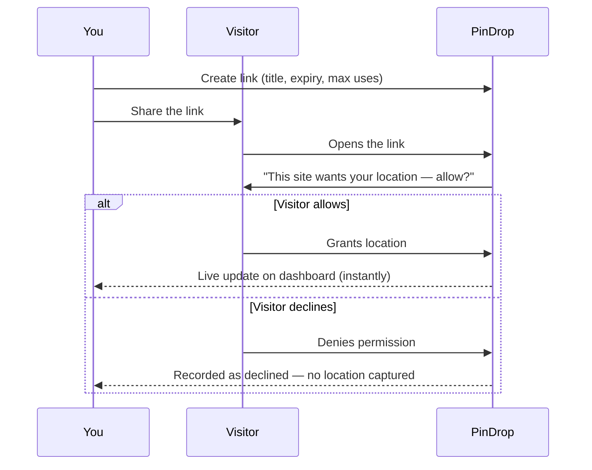

<p align="center">
  
</p>

<h1 align="center">PinDrop</h1>

<p align="center">
  <em>Ask. They allow. You see.</em><br/>
  Consent-based location sharing links — create a link, share it anywhere, and
  see exactly where it was opened the moment someone says yes.
</p>

<p align="center">
  <a href="https://pindrop-locationtracker.firebaseapp.com"><strong>🚀 Live app → pindrop-locationtracker.firebaseapp.com</strong></a>
</p>

<p align="center">
  
  
  
  
  
  
  
</p>

---

## ✨ Features

### Links & sharing
- 🔗 **Shareable consent links** — create a link with a title, optional expiry date, and a max-use limit
- ⏳ **Expiry & usage controls** — auto-expire links by date or cap them by number of uses, or disable one instantly
- 📤 **No app required** — a visitor opens the link in any browser, no PinDrop account or install needed

### Consent & delivery
- ✅ **Explicit opt-in only** — nothing is captured until the visitor's browser asks and they say yes, and they see the link's title first so they know what they're agreeing to
- 📍 **Real-time location delivery** — granted locations land on your dashboard instantly over a live Socket.IO connection
- 🗺️ **Map + reverse geocoding** — every response is plotted on a map with a human-readable address, city, and country

### Insight
- 📊 **Analytics dashboard** — acceptance rate, daily response volume, top countries, and a live activity feed
- 📤 **CSV export** — download the full response history for any link

### Account & platform
- 🔐 **Google Sign-In or email/password** — account settings to link/unlink Google, change your password, or delete your account
- 🌓 **Light & dark mode**
- 📱 **Fully responsive** — works cleanly on mobile, tablet, and desktop
- 🔍 **SEO-ready** — structured data, sitemap, per-route metadata, and full social share previews

---

## 🛠 Tech stack

| Layer | Tools |
|-------|-------|
| Client | React 19, TypeScript, Vite, Tailwind CSS v4, Framer Motion, React Router, TanStack Query |
| Client extras | React Hook Form + Zod, Socket.IO client, Leaflet |
| Server | Node.js, Express 5, TypeScript, Socket.IO |
| Data | Prisma ORM, PostgreSQL (Supabase) |
| Auth | JWT (access + rotating refresh tokens), bcrypt, Google Auth Library |
| Infra | Firebase Hosting (client), Google Cloud Run (server, Docker) |
| Monorepo | npm workspaces (`client`, `server`, `shared`) with shared Zod schemas/DTOs |

---

## 🧱 Architecture

- **`client/`** — React SPA (Vite): `components/`, `pages/`, `lib/`, and `public/` for static assets, favicons, `robots.txt`, `sitemap.xml`
- **`server/`** — Express API + Socket.IO, feature-grouped into `modules/` (auth, links, locations, visitors, settings, dashboard), plus `middleware/` and `lib/`
- **`shared/`** — Zod schemas & DTO types imported by both `client` and `server`, so request/response shapes stay in sync at compile time

### How a link works



Once a link expires, hits its usage limit, or is manually disabled, it stops accepting new responses — but everything already collected stays on your dashboard until you delete it.

---

## 🔐 Security

- Passwords hashed with bcrypt; refresh tokens are hashed before storage and rotated on every use
- Short-lived JWT access tokens + CSRF-protected, `httpOnly` refresh cookies
- Rate limiting on auth and password-sensitive endpoints
- Strict Content-Security-Policy, HSTS, and the full standard security header set
- Ownership checks on every link/location query — one account can never read another's data
- No location data is ever captured without the visitor's explicit, in-the-moment permission

---

## 🚀 Getting started

```bash
git clone https://github.com/vabxsen/PinDrop.git
cd PinDrop
npm install

cp server/.env.example server/.env
cp client/.env.example client/.env
# fill in DATABASE_URL, JWT secrets, GOOGLE_CLIENT_ID, etc.

npm run db:migrate
npm run dev      # runs client + server together
```

The client runs at `http://localhost:5173`, the API at `http://localhost:4000`.

### Other useful scripts

| Command | Description |
|---|---|
| `npm run build` | Build `shared`, `server`, and `client` in order |
| `npm run lint` | Lint the whole monorepo |
| `npm run db:studio` | Open Prisma Studio |
| `npm run db:seed` | Seed the database |

---

## 📦 Deploy

```bash
npm run build
firebase deploy --only hosting                                    # deploy the client
gcloud run deploy pindrop-server --source . --region <region>      # deploy the server
```

Firebase Hosting rewrites `/api/**` and `/socket.io/**` to the Cloud Run service, so client and API are served from the same origin in production.

---

## 📁 Project structure

```
PinDrop/
├─ client/          # React SPA (Vite)
│  ├─ public/       # Static assets, favicons, robots.txt, sitemap.xml
│  └─ src/
│     ├─ components/
│     ├─ pages/
│     └─ lib/
├─ server/          # Express API + Socket.IO
│  ├─ prisma/       # Schema & migrations
│  └─ src/
│     ├─ modules/   # auth, links, locations, visitors, settings, dashboard
│     ├─ middleware/
│     └─ lib/
├─ shared/          # Zod schemas & DTOs shared by client + server
├─ Dockerfile       # Cloud Run build (shared + server)
└─ firebase.json    # Hosting rewrites, security headers
```

---

## 📄 License

[MIT](LICENSE) © 2026 Vaibhav Sen
